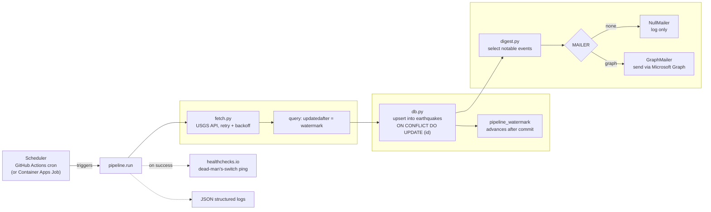

# Project 1 — Scheduled Cloud Ingestion Pipeline

Proves you can build something that runs unattended in the cloud for weeks
without anyone touching it — the same fetch/reconcile/store/notify pattern
nearly all business automation reduces to. A scaffold for the project
described in
[`../PROJECT-1-scheduled-pipeline.md`](../PROJECT-1-scheduled-pipeline.md):
pulls earthquake events from the USGS public API, upserts them into
Postgres/SQLite, and emails a digest of what's notable since the last run.
Personal project built for skill development against a public API — no
production deployment, no real users.



**Retry and logging, spelled out beyond the diagram labels:** `_get_page()`
retries transient USGS failures (HTTP 429/5xx, connection errors, timeouts)
up to 3 attempts total, with exponential backoff plus jitter starting at 1s
and capping at 20s (`tenacity.stop_after_attempt(3)`,
`wait_exponential_jitter(initial=1, max=20)` — `src/pipeline/fetch.py:54-58`).
Every run emits a `run_complete` JSON log line with `fetched`, `inserted`,
`updated`, `skipped`, and `duration_seconds` (`src/pipeline/run.py:86-97`).

---

## Schema, and why the primary key is what it is

```
earthquakes
├── id                 TEXT PRIMARY KEY   -- USGS event id, e.g. "us7000abcd"
├── magnitude          FLOAT
├── mag_type           TEXT               -- "ml", "mww", etc.
├── place              TEXT
├── event_time_ms      BIGINT NOT NULL    -- origin time, UTC epoch ms
├── updated_time_ms    BIGINT NOT NULL    -- USGS revision time, UTC epoch ms (indexed)
├── longitude / latitude / depth_km   FLOAT
├── event_type         TEXT               -- "earthquake", "quarry blast", ...
├── status             TEXT               -- "automatic" | "reviewed"
├── tsunami            BOOLEAN
├── alert_level        TEXT               -- PAGER alert color, or NULL
├── felt_reports       INTEGER
├── url                TEXT
├── raw_json           TEXT               -- full GeoJSON feature, for future reprocessing
├── first_seen_at_ms   BIGINT NOT NULL    -- when this pipeline first wrote the row
└── last_seen_at_ms    BIGINT NOT NULL    -- when this pipeline last touched the row

pipeline_watermark
├── job_name                    TEXT PRIMARY KEY
├── last_updated_watermark_ms   BIGINT    -- incremental cursor (see below)
├── last_run_started_at_ms      BIGINT
├── last_run_completed_at_ms    BIGINT
├── last_run_status             TEXT      -- "running" | "success" | "failed"
└── last_run_error              TEXT
```

**Why the primary key is USGS's own event id, not an autoincrement integer:**
USGS guarantees that id is stable and unique for the life of the event. That
guarantee is what makes reruns safe — the same event fetched twice (a retry,
an overlapping backfill, a crash-and-restart) always maps to the same row,
so there is no way to produce a duplicate. An autoincrement key would make
every fetch a blind insert and push deduplication into application logic
that's easy to get subtly wrong; the natural key pushes it into the
database, where `ON CONFLICT DO UPDATE` handles it in one line.

**Why the watermark tracks `updated_time_ms`, not `event_time_ms`:** USGS
revises magnitude and location on existing events for hours to days after
they occur, as more seismograph data comes in. A watermark on origin time
would fetch each event once and never see later corrections. Filtering the
USGS API on `updatedafter` instead — and watermarking on the same field —
catches new events and revisions to old ones in the same pass. This is also
why a "last 24 hours" window is wrong for a resumed job: it has no memory of
revisions that happened during a gap, whereas `updatedafter=<watermark>`
picks up exactly where the last successful run left off, however long the
gap was.

All timestamps are stored as UTC epoch milliseconds (matching USGS's own
representation) rather than a `DATETIME`/`TIMESTAMP` column, specifically to
avoid timezone round-trip inconsistencies between SQLite (no native
timezone-aware type) and Postgres. See `src/pipeline/timeutil.py`.

---

## Why a rerun and a crash are both safe

- **Idempotent upsert.** `upsert_earthquakes()` compares each incoming
  record's `updated_time_ms` against what's stored. Identical → skipped.
  Different → `INSERT ... ON CONFLICT (id) DO UPDATE`. Fetching the same
  window five times in a row inserts once and skips four times; row count
  never moves. Proved in `tests/test_idempotency.py`.
- **Crash consistency.** Each call to `upsert_earthquakes()` runs as one
  database transaction. If the process is killed mid-batch, nothing in that
  call has committed — the database is exactly as it was before the run
  started. The watermark only advances in a *separate*, later call
  (`complete_run`), so a crash between "data committed" and "watermark
  advanced" just means the next run refetches the same window and reapplies
  it, which is safe for the same reason a plain rerun is safe.
- **Concurrent runs.** Two overlapping runs both upserting the same window
  is harmless for the same reason a rerun is harmless — the natural key and
  the `updated_time_ms` comparison make the operation commutative. This
  scaffold doesn't add a distributed lock on top, because the upsert already
  makes double-execution a no-op rather than a correctness problem; the
  trade-off worth knowing is that two truly simultaneous runs will each pay
  the API/DB cost even though only one changes anything.

---

## Running it locally

```powershell
py -m venv .venv
.venv\Scripts\Activate.ps1
pip install -e ".[dev,postgres]"
copy .env.example .env      # defaults to sqlite:///./local.db — nothing else required

pytest                       # runs the whole suite against an in-memory SQLite db
python -m pipeline.run --dry-run              # preview against the live USGS API, writes nothing
python -m pipeline.run                        # real run: fetch, upsert, maybe send a digest
python -m pipeline.run --backfill-start 2026-08-01T00:00:00 --backfill-end 2026-08-08T00:00:00
```

**Windows note:** `py -m venv .venv` above can fail with
`CommandNotFoundException` if neither `py` nor `python` is on `PATH` —
confirmed by a clean-clone test on this machine, where `where.exe python`
found nothing at all (no stub, no interpreter, no match). A working
interpreter may still exist at `%LOCALAPPDATA%\Microsoft\WindowsApps\` (or
wherever the Python Install Manager / python.org installer placed it) even
though it's missing from `PATH` — check there directly. The fix is either to
add that directory to `PATH`, or to invoke venv creation with the
interpreter's full path, e.g. `& "C:\path\to\python.exe" -m venv .venv`.
This is a **different root cause** than Project 2's README's Windows note:
that one is a non-functional `WindowsApps` app-execution-alias stub that
redirects to the Store instead of running Python; this one is a real,
working interpreter that's simply missing from `PATH`.

`MAILER=none` (the `.env.example` default) logs the digest instead of
sending it, so the pipeline runs end-to-end with zero external
configuration beyond a database. Set `MAILER=graph` plus the `GRAPH_*`
variables to actually send mail — see `src/pipeline/digest.py`.

The digest is only built and sent when notable records exist — enforced by
`if notable and not args.dry_run` in `run.py:109`, not by `digest.py`
itself. `digest.py`'s own functions (`build_digest_html`, `NullMailer.send`,
`GraphMailer.send`) don't independently guard against empty input; that
invariant is enforced by the caller.

The scheduled workflow in `.github/workflows/earthquake-pipeline.yml` also
currently runs with `MAILER=none`, so the "digest email" acceptance
criterion isn't actually being exercised by the live schedule yet — that
needs the `GRAPH_*` secrets added and `MAILER` flipped to `graph` in the
workflow before it's proven end-to-end.

---

## Layout

```
src/pipeline/
├── config.py          # env vars in, dataclass out
├── timeutil.py         # epoch-ms helpers; ISO only at the API boundary
├── fetch.py             # USGS client: retry+backoff, pagination, updatedafter vs. backfill window
├── db.py                 # schema, idempotent upsert, watermark
├── digest.py              # notable-event selection, HTML digest, Graph mailer
├── logging_setup.py        # JSON-lines structured logging
└── run.py                    # CLI: scheduled / --dry-run / --backfill-*
tests/                          # idempotency, upsert, watermark — see test docstrings
deploy/                          # Dockerfile, Container Apps Jobs bicep, GitHub Actions template
.github/workflows/               # earthquake-pipeline.yml — the active scheduled workflow (copied
                                  # from deploy/github-actions-schedule.yml; currently runs with
                                  # MAILER=none until Graph credentials are added, see below)
```

---

## Acceptance criteria

Tracking against `../PROJECT-1-scheduled-pipeline.md`. The scaffold gets you
to the point where all of these are true *once deployed and run*; none of
them are true just by cloning this repo — they require an actual multi-day
run against a real schedule.

- [x] Ran on schedule, unattended, for at least seven consecutive days — GitHub Actions run history confirms 180+ consecutive scheduled runs, zero failures, spanning Aug 17–24/25, 2026 (exceeds the 7-day requirement). Note: healthchecks.io logged a handful of brief down→up recovery blips during this window (each under 25 min, self-recovered, root cause not investigated); GitHub Actions run history shows no corresponding failed runs in those windows, so these are noted for completeness rather than treated as a pipeline failure.
- [x] Re-running any single window is a no-op on row counts — `tests/test_idempotency.py`
- [x] Killing the job halfway leaves the database consistent, and the next run recovers — `tests/test_crash_recovery.py` forces a real mid-batch exception (a verified `ROLLBACK`, not a hand-simulated failure) and confirms zero partial rows land, then that a rerun of the same batch fully recovers; see "Why a rerun and a crash are both safe" above. Caveat: this proves transaction-rollback atomicity, not a literal OS-level process kill — strong evidence for the claim, not an identical reproduction of it.
- [x] `git log -p | grep -i "key\|secret\|password"` returns nothing meaningful — verified: only matches are variable names/refs (`secrets.DATABASE_URL`, empty `GRAPH_CLIENT_SECRET=` placeholder in `.env.example`) and prose mentioning Key Vault, no actual credential values
- [x] Secrets from a vault, retrieved with a managed identity (spec `Requirements`) — met at the scope this project actually calls for: GitHub Actions repo secrets is appropriate for a personal project at this scale; Key Vault + managed identity is the right call once a deployment is enterprise-scale, not before. That's a scoping decision, not a claim that GitHub Actions secrets and Key Vault are technically equivalent security models — they aren't. The schedule that's actually running pulls secrets from GitHub Actions repo secrets. Key Vault + managed identity is implemented in the `deploy/container-apps-job.bicep` / `deploy/README.md` path as the scope-appropriate choice for a larger deployment, not because it's required at this project's scale.
- [x] Alert on the job failing to run at all, not just erroring — healthchecks.io dead-man's-switch is wired up and active; the workflow pings it on success, healthchecks.io alerts if a ping is missed
- [x] This README explains the schema and the natural-key choice
- [x] Digest email actually sent via the Graph API (parent spec: "digest email... sent") — proven in a manual run outside this repo's dev environment: `MAILER=graph` with real `GRAPH_*`/`DIGEST_TO` values produced a `digest_sent` log event, no error, and (per the user who ran it) a confirmed-received email; see "The Graph mailer has been proven end-to-end" below. The live scheduled workflow still defaults to `MAILER=none`, so this is proof the capability works, not that the schedule sends digests automatically.

Fill in the résumé bullet in `../PROJECT-1-scheduled-pipeline.md` with real
numbers once it's actually been run for a while — specific numbers are what
make the bullet invite a good conversation instead of getting skimmed.

---

## What I'd do differently

**The digest-logging bug, and what it says about testing mailers.** An
earlier version unconditionally logged `digest_sent` after calling
`mailer.send()`, regardless of which mailer handled it — so a run with
`MAILER=none` would claim a digest was "sent" when nothing actually left
the building. Both `NullMailer.send()` and `GraphMailer.send()` now return
a `bool` for whether mail actually went out, and `run.py` picks the log
event (`digest_sent` vs. `digest_logged_only`) from that return value
instead of assuming success. The lesson generalizes: a "safe default" mailer
that silently no-ops is exactly the kind of code path that needs its own
explicit test, because it fails by *looking* like it worked, not by
crashing.

**The Graph mailer has been proven end-to-end.** With real
`GRAPH_TENANT_ID`/`GRAPH_CLIENT_ID`/`GRAPH_CLIENT_SECRET`/`DIGEST_TO` values
in `.env` and `MAILER=graph`, a manual run — in a separate terminal session,
outside this assistant's environment — completed the OAuth2
client-credentials flow, called Graph's `sendMail`, and logged:
`{"timestamp": "2026-08-20T16:12:09-0400", "level": "INFO", "message":
"digest_sent", "notable_count": 7}`, no error or traceback. Per the user who
ran it, the email was also confirmed received in the `DIGEST_TO` mailbox;
that part isn't something this assistant observed directly. That settles
the one acceptance criterion in the parent spec ("digest email... sent")
that was previously theoretical. It doesn't mean the *schedule* sends
digests automatically, though: the live scheduled workflow still runs with
`MAILER=none` by default (see above), so it won't spam the mailbox on every
hourly run — this proves the capability works, not that it's wired into the
schedule.

**SQLite is fine for development, but production should be Postgres from
day one.** The upsert logic is dialect-agnostic and the test suite exercises
both, but SQLite's single-writer locking model doesn't hold up well against
a scheduled job that might overlap with a manual backfill or a second
concurrent trigger — the kind of scenario the "why a rerun and a crash are
both safe" section above assumes is merely wasteful, not actively blocking.
If this ran unattended in the cloud, `DATABASE_URL` should point at
Postgres before the first scheduled run, not after the first lock-contention
incident.

**The GitHub Actions `working-directory` mismatch.** The original workflow
template set `defaults.run.working-directory: project-1-scheduled-pipeline`,
written on the assumption that the repo root would be a parent
`meridian-portfolio` monorepo with each project in its own subdirectory.
Since this project is actually its own standalone repo, the repo root
already *is* the project root — that line pointed at a directory that
didn't exist, and every step after checkout would have failed. It never
ran, because the mismatch was caught before the workflow's first trigger,
but it's a reminder that a deploy template copied from a "what if we
restructure later" assumption needs to be checked against the actual repo
layout, not just against how the docs describe it.

**The initial commit is a single large snapshot, not a history.**
`RESUME-AND-INTERVIEW.md` (in the parent portfolio repo) is explicit that
incremental commits with real messages tell a better story than one big
"initial commit" — and this repo's first commit is exactly that pattern:
the whole pipeline, tests, and docs landed in one commit. Everything since
(the workflow, the heartbeat wiring, these README updates) has been
incremental, which is the right shape going forward, but it doesn't undo
how the repo's history opens for anyone who reads it top to bottom.
